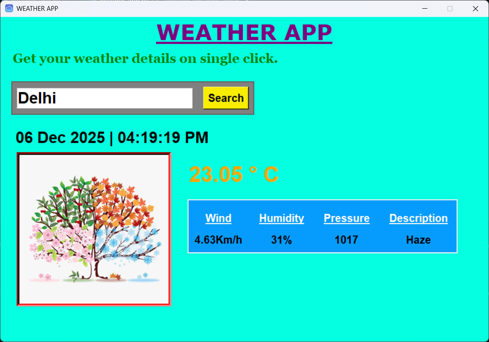

# weather-api-app
Weather app that uses the OpenWeather API 🌦️ Shows live temperature, humidity, wind, and forecast data. Fetches results in real time and displays them in a clean interface. Code covers API calls, data handling, and UI logic.
<h2>Weather App 🌤️</h2>
A simple Python weather app using Tkinter and the OpenWeather API. It shows live weather details including temperature, humidity, wind speed, pressure, and description.

<h3>Features</h3>
Fetch current weather data for any city  
Displays temperature in Celsius   
Shows wind speed, humidity, pressure, and weather description  
Uses OpenWeather API  
Simple Tkinter GUI    

Screenshots

<h3>Installation</h3>
Clone the repo
git clone https://github.com/USERNAME/REPO_NAME.git

Navigate to the project folder
cd REPO_NAME

Install required packages  
pip install -r requirements.txt  

Add your OpenWeather API key  
Create a .env file in the project folder  
Add the line:  
myapi=YOUR_API_KEY_HERE

Run the app  
python weather_app.py

<h3>Usage</h3>
Enter a city name in the input box  
Click Search  
Weather details will appear below

<h3>Files</h3>
weather_app.py → Main GUI code  
api_key.py → Optional file to store API key (if not using .env)  
img_for_apk.jpg → Image displayed in the app  
.env → Store API key securely

<h3>Notes</h3>
Requires Python 3.x  
Install tkinter, requests, python-dotenv, Pillow
